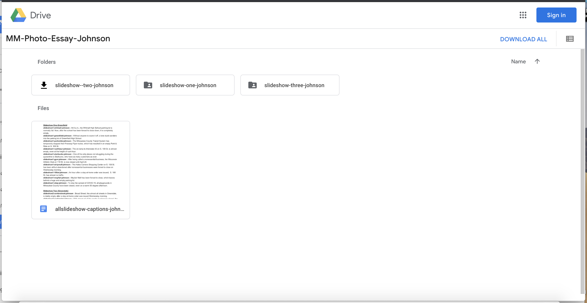

# Downloading a folder from Google Drive

You don't need a Google Account to download a folder from Google Drive. However, the way in which you download a folder differs depending on whether or not you're signed into a Google Account. Both approaches are covered below.

**Note**: If the content of a Google Drive folder appears instead of the folder itself, you can still [download the shared folder](../troubleshooting/content-of-google-drive-folder-appears-instead-of-folder-itself.md).

## Singed in to Google Drive

1. Click link to folder on Google Drive. Your Google Drive will open.
2. Control-click (Mac) or right-click (PC) the folder you'd like to download.&#x20;
3. In the fly-out menu, select **Download**. Google Drive will zip the file before proceeding with the download process. Zip and download times will vary depending on the size of the folder and network speed.
4. When the download is complete, a ZIP file will appear in your **Downloads** folder. Double-click the ZIP file to uncompress the folder.&#x20;

## Not signed in to Google Drive

1. Click link to folder on Google Drive. A web interface will open.
2. Hover your mouse over the folder you'd like to download. A **Download** button (down arrow) will appear above the folder.
3. Click the **Download** button. Google Drive will zip the file before proceeding with the download process. Zip and download times will vary depending on the size of the folder and network speed.&#x20;
4. When the download is complete, a ZIP file will appear in your **Downloads** folder. Double-click the ZIP file to uncompress the folder.&#x20;

